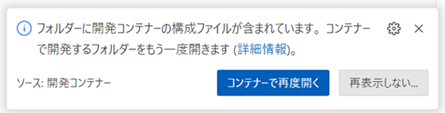
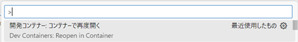

# 🧪sam-lambda

[](https://opensource.org/licenses/MIT)
[](https://www.python.org/)

AWS Lambda を AWS SAM (AWS Serverless Application Model) で構築する実験プロジェクト.

## 概要

Web API を AWS Lambda で構築する際のテンプレートとして利用できるようにする.

## 構成

- AWS SAM
- API Gateway (HTTP API v2)
- AWS Lambda (Python + Powertools for AWS Lambda)
- Visual Studio Code + DevContainer
- Swagger

## 構築 (Windows)

1. アプリケーションの インストール と 初期設定

    1. アプリケーションのインストール

       コマンドプロンプトで、以下のコマンド実行  

       ```bat
       winget install -e --id Microsoft.VisualStudioCode
       winget install -e --id SUSE.RancherDesktop
       ```

    2. Visual Studio Codeの拡張機能のインストール

        コマンドプロンプトを再度開きなおして、以下のコマンドを実行

        ```bat
        code \
          --install-extension MS-CEINTL.vscode-language-pack-ja \
          --install-extension ms-vscode-remote.vscode-remote-extensionpack
        ```

    3. RancherDesktopを起動する

    4. コマンドプロンプトで、以下のコマンドを実行

        ```bat
        docker run --privileged --rm tonistiigi/binfmt --install arm64
        ```

2. プロジェクトの 取得 と 初期設定  

    1. プロジェクトの取得

        コマンドプロンプトで、以下のコマンド実行  

        ```bat
        git clone https://github.com/310ken1/sam-lambda.git
        ```

    2. 初期設定

        プロジェクト内の以下のバッチファイルを実行する.

        ```text
        setup.bat
        ```

3. 開発環境（DevContainer） の構築

    1. Visual Studio Code を起動する

    2. Visual Studio Code に本リポジトリを「フォルダを開く」で追加する  
        [ファイル(F)]-[フォルダを開く...]

    3. 以下が表示されるので「コンテナーを再度開く」を選択する

        

        もしくは Ctrl+Shift+P で「Dev Containers: ReOpen in Container」を実行する
        

4. AWSアカウントの登録

    ターミナルで、以下のコマンドを実行する

    ```shell
    aws configure
    ```

    もしくは

    ```shell
    aws configure sso
    ```

## 実行

### ビルド

ターミナルで、以下のコマンドを実行する

```shell
mise run build
```

### ローカル実行

ターミナルで、以下のコマンドを実行する

```shell
mise run local
```

### デプロイ

ターミナルで、以下のコマンドを実行する

```shell
mise run deploy
```

### 削除

ターミナルで、以下のコマンドを実行する

```shell
mise run delete
```
